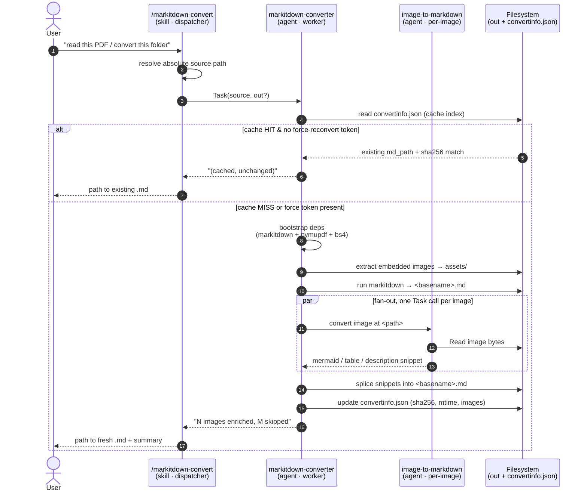

# markdown_converter

File-to-Markdown conversion plugin for Claude Code. Converts PDF / Word / PowerPoint / Excel / HTML / EPUB / images / audio / CSV / JSON / XML into clean Markdown, caches results by SHA256, and enriches embedded images with semantic content (flowcharts → mermaid, tables → markdown tables, everything else → structured description).

## Components

This plugin bundles **1 skill + 2 agents** that work as a pipeline:

| File | Role |
|---|---|
| `skills/markitdown-convert/SKILL.md` | Dispatcher — recognizes the user intent and hands off to the worker agent. |
| `agents/markitdown-converter.md` | Worker — runs the conversion, manages the cache, orchestrates image extraction. |
| `agents/image-to-markdown.md` | Sub-worker — converts one image into mermaid / table / structured markdown. |

The three are tightly coupled by design; installing or disabling the plugin flips all three together.

## Flow (sequence diagram, swimlane style)

GitHub renders this block natively — each `participant` column is a swimlane.



Key properties this diagram encodes:

- **Cache-first**: the very first tool call is the cache check. A hit short-circuits everything (single tool call total).
- **Force-reconvert opt-in**: the caller's prompt must contain `refresh`, `reconvert`, `force`, `rerun`, etc. for a HIT to be treated as MISS.
- **Parallel image enrichment**: when multiple images exist in one source, the worker fires N `image-to-markdown` Task calls in a single message — they run concurrently.

## Supported source formats

Documents
: `.pdf`, `.docx`, `.pptx`, `.xlsx`, `.html`, `.htm`, `.epub`

Images (inline)
: `.png`, `.jpg`, `.jpeg`, `.webp`, `.gif`, `.bmp`

Audio (transcription via markitdown)
: `.mp3`, `.wav`, `.m4a`

Data
: `.csv`, `.json`, `.xml`

Folders are also accepted — the worker globs recursively and mirrors the source tree under `out/`.

URLs (`http://`, `https://`) are passed straight through to markitdown, which handles the HTTP fetch internally.

## Usage

Install from this marketplace:

```bash
/plugin marketplace add SyunHsieh/claude-marketplace
/plugin install markdown_converter@c0917-stacks
```

Then in any Claude Code session, just reference a supported file — the skill auto-triggers:

> "read `C:/Users/me/Downloads/2025-report.pdf` and summarise"

Or explicitly:

```
/markitdown-convert C:/Users/me/Documents/client-docs
```

## Output layout

For a source `foo.pdf`, the worker produces:

```
<out>/
├── convertinfo.json          ← cache index (shared across all sources in this out/)
└── foo/
    ├── foo.md                ← converted markdown (image snippets already spliced in)
    └── assets/               ← extracted images
        ├── p001_i01.png
        └── p002_i01.png
```

- Default `<out>` is `<cwd>/tempMarkdown` when the caller doesn't specify one.
- Collisions are resolved by numeric suffix (`foo.1.md`, `foo.2.md`), never by overwrite.
- The worker is **non-destructive** — source files are never moved, renamed, or deleted.

## Cache behaviour

The cache lives in `<out>/convertinfo.json` and is keyed by absolute source path. Each entry stores `size`, `sha256`, `mtime`, `md_path`, `images`, and `converted_at`.

Lookups return:

- **HIT** — same path AND same sha256 AND the md file still exists on disk.
- **HIT (content-match)** — a different path has identical sha256; the existing md is reused and the new path is recorded as an alias.
- **MISS** — file modified, md missing, or never seen before.

### Force-reconvert tokens

Any of these in the caller's prompt (case-insensitive) forces the pipeline to re-run even on a HIT:

`re-convert`, `reconvert`, `re-fetch`, `refetch`, `refresh`, `force`, `bypass cache`, `ignore cache`, `overwrite`, `rerun`, `re-run`, `redo`

Plain re-invocation with the same source is **not** a refresh.

## Requirements

- Python 3.9+ available on `PATH`
- `pip` (the worker auto-installs `markitdown[all]`, `pymupdf`, `beautifulsoup4` on first actual conversion — cache hits skip the bootstrap entirely)
- No external binaries required (no `pdfimages`, no `unzip`); all extraction is pure Python via `pymupdf`, stdlib `zipfile`, and `bs4`.

## License

Same as the parent marketplace — see repo root.
